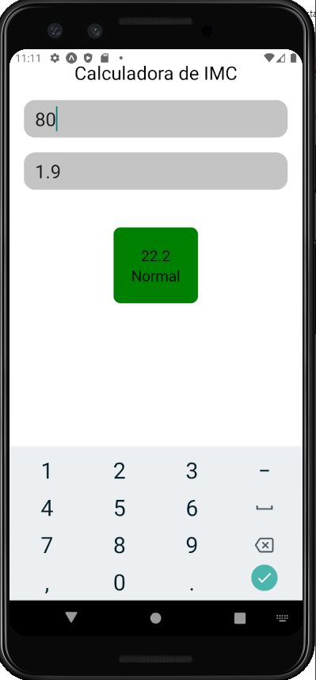

<h1 align="center">
    
</h1>

<h4 align="center"> 
	 🧑🏻‍🏫 Aplicativo para calcular o IMC ✅
</h4>

<p align="center">
  

  

  

  	
  <a href="https://img.shields.io/github/license/lailson/calculadora_imc_expo">
  </a>
	
  


</p>


## 💻 Sobre o projeto

♻️ APP IMC - É um aplicativo criado na disciplina de programação para dispositivos móveis criado em sala de aula (google meet) para mostrar os seguintes conceitos de react:

- Styled components
- useState
- useEffect
- git
  

## 🎨 Layout

O layout da aplicação está disponível no Figma:

<a href="https://www.figma.com/file/IIl056SE42GyVKGNeMQLqJ/calculadora-imc?node-id=0%3A1">
  
</a>


### Mobile

<p align="center">
  

</p>

## 🛠 Tecnologias

As seguintes ferramentas foram usadas na construção do projeto:

- [Expo](expo)
- [Node.js](nodejs)
- [React](reactjs)
- [React Native](rn)


## 🚀 Como executar o projeto

A aplicaçao foi criada utilizando o expo-cli então para rodar no seu compuatdor é necessário a instalaçao prévia. 

### Pré-requisitos

Antes de começar, você vai precisar ter instalado em sua máquina as seguintes ferramentas:
[Git](https://docs.expo.io/workflow/expo-cli/), [Nodejs](https://nodejs.org/en/) e [yarn](https://yarnpkg.com/). 
Além disto é bom ter um editor para trabalhar com o código como [Vscode](https://code.visualstudio.com/)

### 📱 Rodando em um emulador, celular ou web

```bash
# Clone este repositório
$ git clone https://github.com/lailson/calculadora_imc_expo

# Acesse a pasta do projeto no terminal/cmd
$ cd calculadora_imc_expo

# Iniciar o servidor
$ yarn start
```


## 😯 Como contribuir para o projeto

1. Faça um **fork** do projeto.
2. Crie uma nova branch com as suas alterações: `git checkout -b my-feature`
3. Salve as alterações e crie uma mensagem de commit contando o que você fez: `git commit -m "feature: My new feature"`
4. Envie as suas alterações: `git push origin my-feature`
> Caso tenha alguma dúvida confira este [guia de como contribuir no GitHub](https://github.com/firstcontributions/first-contributions)


## 📝 Licença

Este projeto esta sobe a licença MIT.

Feito com ❤️ por Lailson Henrique 👋🏽 
